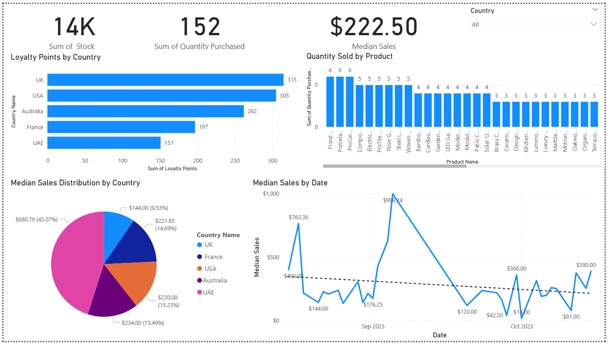
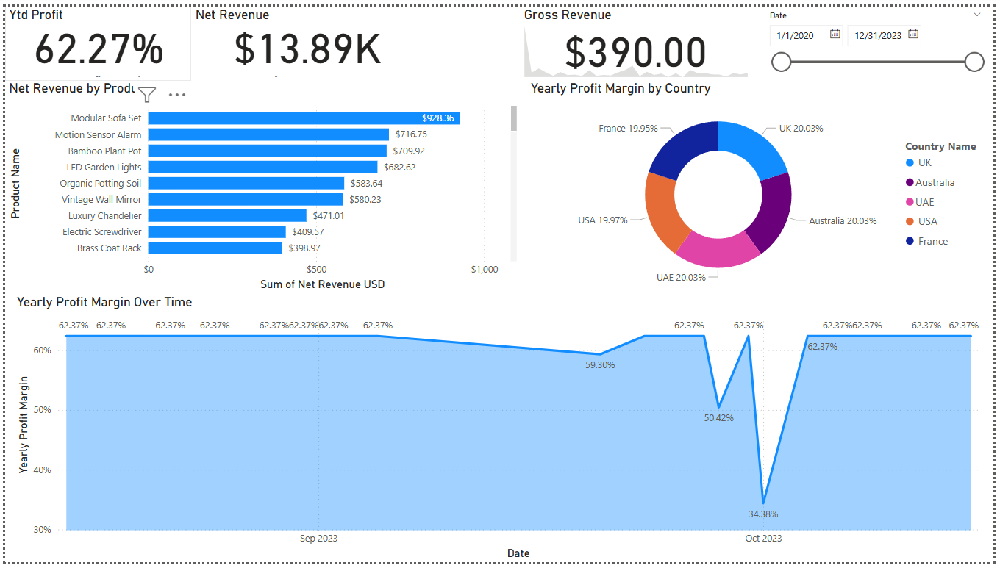

# Power BI Capstone: Tailwind Traders Business Insights
**A multi-page Power BI business dashboard for Tailwind Traders: built with DAX, performance optimization, and storytelling principles.**

## Objective
This project presents an interactive Power BI report built for **Tailwind Traders**, a retail company seeking better visibility into their **sales performance**, **profitability**, and **operational efficiency**.

The report includes **Sales**, **Profit**, and **DAX-based aggregation** dashboards, all developed in a single Power BI `.pbix` file with performance optimization practices applied.

---

## Tools & Skills Used
- Microsoft Power BI Desktop
- Data Modelling  
- DAX (MEDIAN, TOTALYTD, DATESQTD & DIVIDE)  
- Performance Analyzer  
- KPI cards, slicers, time intelligence  
- Dashboard structuring & storytelling  

---

## Report Structure (All in One `.pbix`)
### **Sales Overview Page**
- **Bar Chart**: Loyalty Points by Country  
- **Column Chart**: Quantity Sold by Product  
- **Pie Chart**: Median Sales by Country  
- **Line Chart**: Median Sales Over Time  
- **KPI Cards**: Stock, Quantity Purchased, Median Sales  
- **Slicer**: Country filter for interactivity  

### **Profit Overview Page**
- **Bar Chart**: Net Revenue by Product  
- **Donut Chart**: Yearly Profit Margin by Country  
- **Area Chart**: Yearly Profit Margin Over Time  
- **Cards**: YTD Profit, Net Revenue USD  
- **KPI Visual**: Gross Revenue trend  
- **Slicer**: Date range control  

### **Calculated Table**
- Created Calculated Table:  
  - `Calendar Table`  
  - `Sales in USD`

### **Load Table from python script**
  - `Historical Currency Exchange data python script`
```    
import pandas as pd
from io import StringIO
data = """Exchange ID;ExchangeRate;Exchange Currency
1;1;USD
2;0.75;GBP
3;0.85;EUR
4;3.67;AED
5;1.3;AUD"""
df = pd.read_csv(StringIO(data), sep=';')

#Return the transformed dataframe`
df
```
  
### **DAX Aggregation & Performance Page**
- Created DAX measures:  
  - `Yearly Profit Margin`  
  - `Quarterly Profit (DATESQTD)`  
  - `YTD Profit (TOTALYTD)`  
  - `Median Sales (MEDIAN)`  
- Tested visuals using **Performance Analyzer** to ensure load time < 400ms  
- Removed unnecessary visuals post-optimization  

---

## Key Insights
- Sales are uneven across countries, some with high loyalty points show low profitability.  
- Median-based metrics revealed outliers hidden by averages.  
- DAX aggregations allowed detailed profitability breakdowns YTD and quarterly.  
- Performance Analyzer shows performances is not exceeding 400 ms.  

---

## Report Screenshots
*See `/visuals/` folder for snapshots of each dashboard page.*


## Screenshots

### Sales Overview Dashboard


## Outcome
This capstone demonstrates my ability to:
- Build layered, interactive dashboards with dynamic metrics
- Write efficient DAX for time-based analysis
- Optimize Power BI reports using built-in diagnostics
- Translate raw business data into stakeholder-facing reports

---

## Files Included
- `Tailwind_Traders_Report.pbix` – Full interactive report with dashboards and optimized visuals  
- `/visuals/` – Screenshot files for preview on GitHub/LinkedIn  

